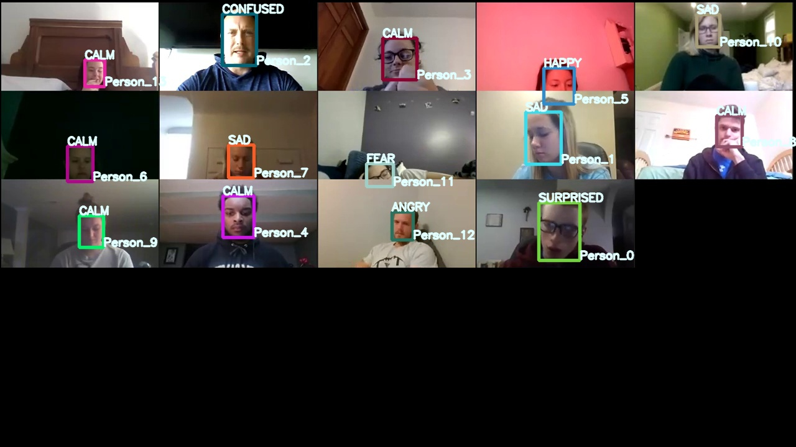

# EngagementAI

<center></center>

## Introduction
This project uses AWS Rekognition for the emotion detection. Based on the emotion detected, further analysis is made.

## How to use this software?

## How to use this software?
## How to use this software?

Step 1:
Download Repository and dependencies
```bash
conda create -n engagementai python=3.7.3
```
```bash
conda activate engagementai
```

```bash
git clone https://github.com/ashishkrb7/EngagementAI.git
```
```bash
cd EngagementAI
```
```bash
python -m pip install -r requirements.txt
```
Step 2:
Modify [./config/credentials.json](./config/credentials.json)
```JSON
    {
        "User name": "ashish_temp",
        "Access key ID": "XXXX",
        "Secret access key": "XXXX",
        "Bucket_name":"rekoengagementai",
        "Folder_in_S3":"artifact"
    }
```
- Modify `Folder_in_S3` to avoid error or overwritting in S3
  
Step 3:

Modify *.csv for [Marks](./db/input/docs/Marks.csv) and [QnA](./db/input/docs/QnA.csv)

Step 4:
```bash
Python 3.7.3 (default, Apr 24 2019, 15:29:51) [MSC v.1915 64 bit (AMD64)] :: Anaconda, Inc. on win32
Type "help", "copyright", "credits" or "license" for more information.
>>> from src.engine import reset
>>> reset()
```

Step 5:
Download Video from this link "https://www.youtube.com/watch?v=53yPfrqbpkE&ab_channel=WaipaDistrictCouncil" and put downloaded files at `./db/input/videos/SourceDump/`
**Modify the file Name**
```python
if __name__=="__main__":

    V2I=int(input("\nDo you want to convert video to image?[Press 1 for Yes and 0 for No or you alread have in OutputDump folder]:"))

    if V2I==1:
        Videos2Images.run(inputpath = rootpath+'/db/input/videos/SourceDump/Finance & Corporate Committee - Zoom Meeting.mp4',fps = 100,imageExt=".jpg",OutputName=jsonFileAlias)
```
**Replace Finance & Corporate Committee - Zoom Meeting.mp4** with your file name

Step 6:
Run following command and follow the prompt instruction
```bash
python app.py
```
