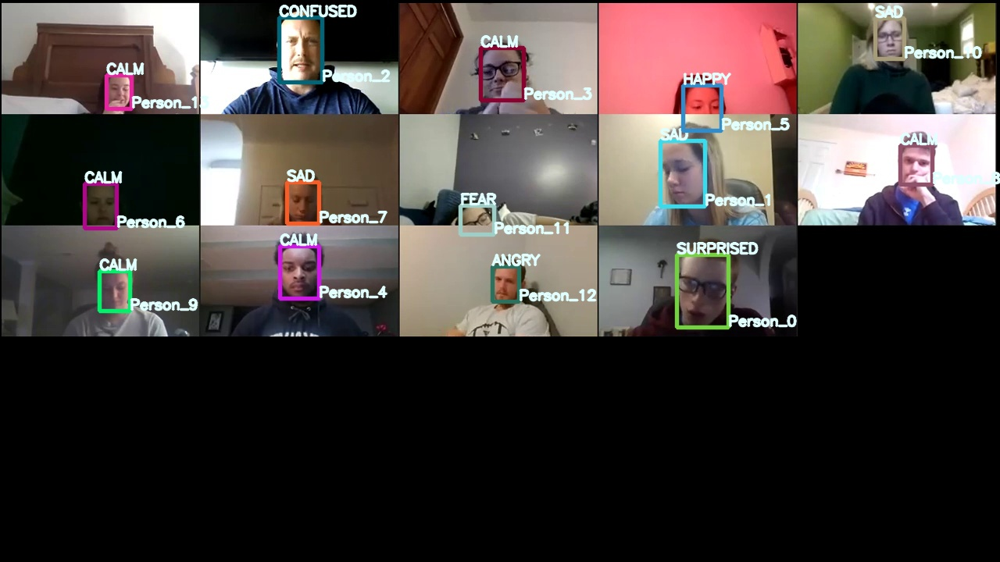

# EngagementAI

<center></center>

## Introduction
This project uses AWS Rekognition for the emotion detection. Based on the emotion detected, further analysis is made.

## How to setup the environment for this project?
1. Install Anaconda from this link https://www.anaconda.com/products/individual#windows and follow the steps mentioned in following link
https://docs.anaconda.com/anaconda/install/windows/

2. After Anaconda installation, go to search and run Anaconda Prompt and create virtual environment using following commands.

    `conda create -n engagementai python=3.7.3`

    `conda activate engagementai`

3. Run Anaconda prompt and change the drive to the location to this directory and run command `python -m pip install -r requirements.txt`. This will install all the packages require for model execution.

## How to convert video to images?
*You should be present at the directory location of [README.md]('./README.md')*

Code Location : [Videos2Images.py](./src/utils/Videos2Images.py)

```bash
python src/utils/Videos2Images.py --inputpath C:/Users/imash/Documents/upwork/db/input/videos/SourceDump/sample.mp4 --fps 10 --imageExt .jpg --OutputName frame
```

```bash
python src/utils/Videos2Images.py -i C:/Users/imash/Documents/upwork/db/input/videos/SourceDump/sample.mp4 -f 10 -e .jpg -o frame
```

**Explaination**

- inputpath : Input path of the Sample Video
- fps : Frame per second
- imageExt : File extension. This archetecture supports only *.jpg format
- OutputName : Alias of the output file name

If you don't want to involve in complexity of input argument, then just insure that your video should be available at `./db/input/videos/SourceDump`. Script will dump your images at `./db/input/videos/OutputDump/frame*.jpg` with an alias of `frame` and run below command.

```bash
python src/utils/Videos2Images.py
```


*As of now user are suppose to do the selection of images need to be analyzed.*

